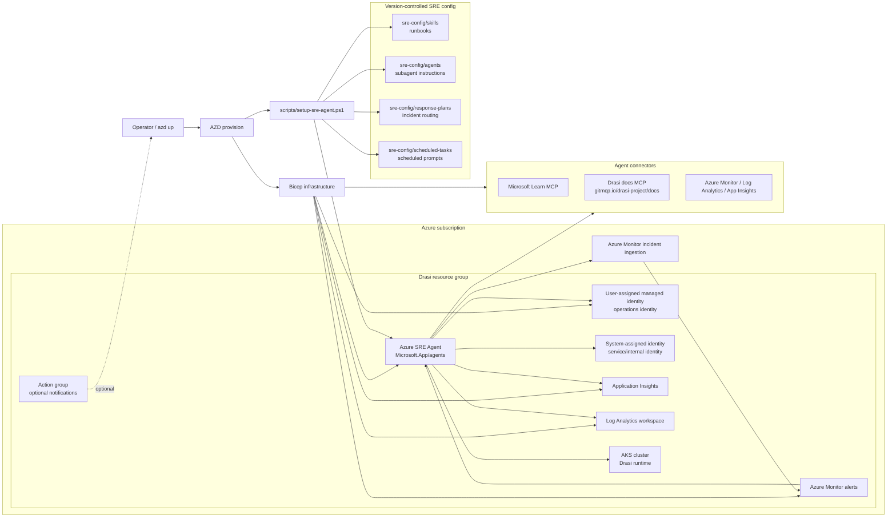

# Deploy Azure SRE Agent with support for Drasi & AKS

This repository can deploy an Azure SRE Agent for a Drasi-on-AKS implementation by using Azure Developer CLI.

It is intended to be a public, repeatable blueprint for teams that want to see how Azure SRE Agent can be deployed as code, connected to Azure Monitor, and extended with version-controlled agents, skills, response plans, scheduled tasks, and AKS/Drasi reliability tests.

## What This Repository Is

This repo has two jobs:

1. Deploy the Azure SRE Agent platform resources with `azd up`.
1. Configure the SRE Agent data-plane objects that make it useful for AKS and Drasi operations.

The split matters. Some Azure SRE Agent objects are ARM resources and belong in Bicep. Other objects are currently configured through the SRE Agent data-plane API after provisioning. This repo keeps both parts version-controlled, so a new environment can be rebuilt without manual portal-only steps.

## How The Pieces Fit Together

| Path                               | Role in the Blueprint                                                                                                                                             | Update When…                                                                           |
| ---------------------------------- | ----------------------------------------------------------------------------------------------------------------------------------------------------------------- | -------------------------------------------------------------------------------------- |
| `azure.yaml`                       | Main Azure Developer CLI entry point. Defines the `azd up` deployment workflow and post-provision hook execution.                                                 | The deployment lifecycle or hook flow changes.                                         |
| `infra/main.bicep`                 | Subscription-scope infrastructure entry point. Resolves the target resource group and Azure Kubernetes Service cluster, then invokes the workload wrapper module. | Subscription-level parameters, target placement, or RBAC scope requirements change.    |
| `infra/drasi-sre-agent.bicep`      | Workload wrapper for the Drasi + AKS blueprint. Deploys the SRE Agent, identities, connectors, telemetry wiring, and alerting baselines.                          | New operational baselines, alerts, connectors, or managed dependencies are introduced. |
| `infra/drasi-sre-agent-rbac.bicep` | RBAC definitions for both user-assigned and system-assigned agent identities across AKS and resource group scopes.                                                | Permissions are reduced, expanded, or scoped differently.                              |
| `avm/res/app/agent/`               | Reusable AVM-style module for `Microsoft.App/agents`. Designed to remain workload-agnostic.                                                                       | The core reusable agent resource needs new generic parameters, outputs, or patterns.   |
| `scripts/setup-sre-agent.ps1`      | Post-provision configuration script. Uploads skills, subagents, response plans, scheduled tasks, and enables MCP integrations.                                    | API payloads, naming conventions, or provisioning behavior changes.                    |
| `sre-config/agents/`               | Subagent instruction sets for specialist workflows (triage, diagnostics, remediation).                                                                            | Agent routing logic or specialist responsibilities evolve.                             |
| `sre-config/skills/`               | Operational runbooks and diagnostic skill content used by the SRE Agent.                                                                                          | Troubleshooting logic or remediation guidance is updated.                              |
| `sre-config/response-plans/`       | Alert routing and incident-response orchestration definitions.                                                                                                    | Alert severity, routing rules, or autonomy levels change.                              |
| `sre-config/scheduled-tasks/`      | Proactive recurring tasks (health checks, resilience reports, drift detection).                                                                                   | Operational cadence or proactive reporting needs adjustment.                           |
| `sre-config/testing/`              | Fault-injection scenarios and route validation definitions for chaos/regression testing.                                                                          | Test coverage expands, or scenarios are retired.                                        |
| `examples/`                        | Optional reusable deployment patterns, validation packs, and reference implementations.                                                                           | New reusable patterns or optional extensions are added.                                |


## Deployment Lifecycle

`azd up` runs the repo in this order:

1. `infra/main.bicep` deploys or updates the Azure resources.
1. `infra/drasi-sre-agent.bicep` calls the local AVM-style SRE Agent module and adds this blueprint's AKS/Drasi alerting baseline.
1. `infra/drasi-sre-agent-rbac.bicep` assigns the agent identities the scoped permissions needed for inspection and reviewed remediation.
1. `scripts/setup-sre-agent.ps1` calls the SRE Agent endpoint and uploads the data-plane configuration from `sre-config/`.
1. The post-provision script verifies and enables MCP tool visibility for `microsoft-learn` and `drasi-docs`, because a connected MCP server is not enough if the tools are not active for the agent.

The result is an Azure SRE Agent that can receive Azure Monitor incidents, route them to AKS or Drasi specialists, run scheduled checks, and use Microsoft Learn plus live Drasi docs during investigations.

## Safety Defaults

The blueprint is designed to start safely:

- Response plans default to `Review` unless a route is explicitly approved for autonomy.
- The only autonomous route currently recommended by this pattern is `aks-cluster-stopped -> az aks start`, and only when that route has been pre-approved for the target environment.
- Always-true synthetic alerts are disabled by default and should be enabled only during route validation windows.
- AKS add-on changes, DCR/DCRA recreation, scale-out, upgrades, finalizer removal, and networking changes stay approval-gated.
- Workload-specific alerts stay in `infra/drasi-sre-agent.bicep`; the AVM module remains generic.

## Azure SRE Agent State

Azure SRE Agent is generally available, but the ARM resource provider surface used by this repo is still `Microsoft.App/agents@2025-05-01-preview`. That is why this repo uses Bicep for the stable resource pieces and `scripts/setup-sre-agent.ps1` for data-plane configuration such as custom skills, subagents, response plans, scheduled tasks, and MCP tool enablement.

Current public deployment regions are:

| Region | Canonical name | Area |
| --- | --- | --- |
| East US 2 | `eastus2` | United States |
| Sweden Central | `swedencentral` | Europe |
| Australia East | `australiaeast` | Asia Pacific |

This repo defaults to `australiaeast`. The agent can manage resources in other regions when the managed identity has permission; the agent region controls where the agent itself runs.

Azure SRE Agent is billed in Azure Agent Units (AAUs). There are two cost components:

| Component | What it means | Billing behavior |
| --- | --- | --- |
| Always-on flow | Baseline cost for keeping the agent provisioned and available. | `4 AAUs` per agent-hour from creation until deletion. Stopping the agent stops active work, but the always-on cost continues. |
| Active flow | Token-based cost when the agent works on chat, incidents, scheduled tasks, async operations, reports, or remediation. | Charged by model token usage across input, output, cache read, and cache write. |

The deployment creates:

- `Microsoft.App/agents` Azure SRE Agent
- user-assigned managed identity for SRE Agent resource operations
- Application Insights linked to the Drasi Log Analytics workspace
- managed-resource scope pointing at the Drasi resource group
- Azure Monitor, Application Insights, Log Analytics, Microsoft Learn, and live Drasi docs MCP connectors
- post-provision SRE Agent skills for Drasi runtime diagnostics, AKS platform diagnostics, and remediation review
- post-provision Azure Monitor incident response plans for Drasi platform faults and Drasi processing lag
- post-provision subagents and scheduled tasks:
    - `drasi-incident-triage`
    - `drasi-runtime-diagnostics`
    - `aks-platform-diagnostics`
    - `drasi-remediation-review`
    - `drasi-health-probe-15m`
    - `drasi-daily-resilience-report`
- scoped RBAC on the Drasi resource group and AKS cluster

It expects the Drasi AKS resource group and AKS cluster to exist when managing a live Drasi implementation. The Log Analytics workspace is created when missing and reused when present.

The deployed skills and subagents use Kepner-Tregoe structure where useful: situation appraisal, problem specification, distinction/change analysis, probable cause, decision analysis, and potential problem analysis.

## Optional Examples

The `examples/` folder contains reusable patterns that are useful but should not be forced into every deployment.

- [`examples/aks-observability-baseline`](examples/aks-observability-baseline/README.md) documents the Container Insights missing alert, DCR/DCRA checks, KQL data-path proof, opt-in synthetic route validation, cleanup commands, and expected SRE Agent evidence.

Use these examples as copy-forward baselines when adapting the repo to another AKS workload or when building a production readiness checklist.

## Architecture



## Permissions Model

| Principal                      | Scope                | Role                                            | Why                                                                            |
| ------------------------------ | -------------------- | ----------------------------------------------- | ------------------------------------------------------------------------------ |
| Deploying user                 | SRE Agent resource   | SRE Agent Administrator                         | Allows the operator to administer the deployed agent.                          |
| User-assigned managed identity | Drasi resource group | Reader                                          | Lets the agent inspect managed Azure resources.                                |
| User-assigned managed identity | Drasi resource group | Monitoring Reader                               | Lets the agent inspect Azure Monitor state.                                    |
| User-assigned managed identity | Drasi resource group | Log Analytics Reader                            | Lets the agent query workspace-backed AKS and Drasi telemetry.                 |
| User-assigned managed identity | AKS cluster          | Azure Kubernetes Service Cluster User Role      | Allows AKS command access bootstrap.                                           |
| User-assigned managed identity | AKS cluster          | Azure Kubernetes Service RBAC Cluster Admin     | Lets SRE Agent run Kubernetes diagnostics and reviewed remediation commands.   |
| User-assigned managed identity | Subscription         | Monitoring Contributor                          | Lets Azure Monitor incident ingestion enumerate and correlate fired alerts.    |
| System-assigned identity       | Drasi resource group | Reader, Monitoring Reader, Log Analytics Reader | Supports service-internal resource and telemetry operations.                   |
| System-assigned identity       | AKS cluster          | Azure Kubernetes Service RBAC Cluster Admin     | Supports service-internal Kubernetes operations used by the SRE Agent service. |
| System-assigned identity       | Subscription         | Monitoring Contributor                          | Supports Azure Monitor alert correlation for service-internal flows.           |

Keep the broad Kubernetes role in Review mode for production. Move to narrower Kubernetes RBAC once the exact command surface is known and tested.

## Configure A New Drasi Environment

```powershell
azd env new <environment-name> --subscription <subscription-id> --location <australiaeast|eastus2|swedencentral>

azd env set DRASI_RESOURCE_GROUP_NAME <drasi-resource-group>
azd env set DRASI_AKS_CLUSTER_NAME <aks-cluster-name>
azd env set DRASI_LOG_ANALYTICS_WORKSPACE_NAME <log-analytics-workspace-name>
azd env set AZURE_RESOURCE_GROUP <agent-resource-group>
azd env set AZURE_SRE_AGENT_NAME <agent-name>
azd env set AZURE_SRE_AGENT_APPINSIGHTS_NAME <application-insights-name>
azd env set AZURE_SRE_AGENT_IDENTITY_NAME <user-assigned-identity-name>
```

Use the same value for `AZURE_RESOURCE_GROUP` and `DRASI_RESOURCE_GROUP_NAME` when the agent should live beside the Drasi AKS resources.

## Deploy

```powershell
azd provision --preview --no-prompt
azd up --no-prompt
```

`azd up` runs a repo-local workflow that executes `azd provision`. This repo is infrastructure-only, so the workflow intentionally skips `azd deploy` and avoids unrelated Drasi app deployment extension hooks.

The post-provision hook in `scripts/setup-sre-agent.ps1` configures data-plane SRE Agent capabilities that are not portable through ARM in this tenant, including custom skills, subagents, response plans, and scheduled tasks.

## Production Readiness Notes

- The agent remains in `Review` mode. It can investigate and propose fixes, but write actions require review.
- The agent deploys on `upgradeChannel: Preview` with workspace tools/v2 agent loop feature flags enabled. The current public ARM provider is still `Microsoft.App/agents@2025-05-01-preview`, but these settings align the resource with the newer SRE Agent runtime path used for improved sandbox, code/file access, and log-to-code investigation where enabled by the service.
- Azure Monitor, Application Insights, Log Analytics, Microsoft Learn, and live Drasi docs MCP connectors are deployed as ARM child resources.
- MCP connector tools are explicitly assigned by the post-provision hook. Microsoft Learn tools are bound as `microsoft-learn_*`, and live Drasi documentation tools from `https://gitmcp.io/drasi-project/docs` are bound as `drasi-docs_*`, so future `azd up` runs do not depend on manual portal checkbox selection.
- SRE Agent skills and response plans are configured through the data-plane API because this tenant rejects ARM `Microsoft.App/agents/skills` and `Microsoft.App/agents/incidentFilters` as internal-only Agent Extensions.
- Knowledge graph resource indexing is enabled by default because Azure Monitor incident ingestion and the portal managed-resources view depend on it. The agent indexes the Drasi resource group and AKS cluster as managed resources.
- The agent identities receive subscription-scope `Monitoring Contributor` so Azure Monitor incident ingestion can enumerate and correlate fired alerts.
- The deployment creates an Activity Log alert for successful AKS stop operations so a powered-off cluster is routed as a platform condition even when Kubernetes telemetry stops flowing.
- The user-assigned identity receives AKS RBAC Cluster Admin on the target AKS cluster because SRE Agent Kubernetes tools execute as the operations identity. The system-assigned identity also keeps AKS RBAC Cluster Admin for service-internal agent operations.
- The user-assigned identity receives resource-group read roles and AKS cluster-user access for managed resource operations.
- Remediation guidance must include KT decision analysis, rollback, validation, and potential problem analysis before writes.
- Scheduled tasks are configured through the SRE Agent data-plane API after provisioning.

## Response Plan Coverage

Response plans are stored in `sre-config/response-plans/response-plans.json` and uploaded by `scripts/setup-sre-agent.ps1`.

The first route is a broad `drasi-aks-sev0-sev3-catchall` fallback for Sev0-Sev3 AKS/Drasi alerts in the managed resource group. It sends unknown alerts to `drasi-incident-triage` so the agent can classify the fault domain and hand off to a specialist.

Current AKS response plans route directly to `aks-platform-diagnostics`:

- AKS cluster stopped / `managedClusters/stop/action`
- CoreDNS / kube-dns unavailable
- node health or pressure
- pod scheduling failures and `FailedScheduling`
- image pull failures and registry/ACR problems
- storage mount or attach failures
- Dapr system faults
- Cilium or network faults
- Azure Monitor agent faults
- admission webhook unavailable or timing out
- cluster autoscaler disabled, capped, backoff, or deadlocked
- metrics API or external metrics API unavailable, including KEDA metrics API faults
- node-pressure eviction or pressure-driven NotReady
- SNAT port exhaustion
- API server overload, throttling, or noisy LIST/watch clients
- konnectivity tunnel faults on private-cluster operations paths
- AKS upgrade blockers from PDBs, quota/SKU/allocation capacity, subnet IP exhaustion, or version skew
- Kubernetes namespace/PVC termination blocked by finalizers, webhooks, or unhealthy APIServices

Current Drasi response plans route directly to `drasi-runtime-diagnostics` where the fault domain is obvious:

- Drasi control plane unavailable
- Drasi source unavailable or unhealthy
- query staleness or query host fault
- reaction unavailable
- Redis, Mongo, or Dapr state store faults
- Drasi partial upgrade or failed rollback
- Drasi Source and Continuous Query bootstrap race
- Drasi Source deleted while dependent queries remain

Broad Drasi platform and processing-lag alerts route to `drasi-incident-triage`, which then hands off to the right specialist.

Fault-injection coverage is tracked in `sre-config/testing/aks-sre-agent-fault-injection.md`. Use it to test whether the SRE Agent handles known plans and unknown catch-all alerts correctly before trusting the automation more broadly. Each listed route has a synthetic alert trigger of `sre-e2e-<route-id>` so routing can be tested without creating unsafe faults in a shared cluster.

## Version-Controlled Agent Content

Agent runbooks and instructions are stored as markdown under `sre-config/` so they can be reviewed independently from the deployment script.

Skill runbooks live under `sre-config/skills/`:

- `aks-platform-diagnostics.md`
- `drasi-remediation-review.md`
- `drasi-runtime-diagnostics.md`

Subagent instruction prompts live under `sre-config/agents/`:

- `aks-platform-diagnostics.md`
- `drasi-incident-triage.md`
- `drasi-remediation-review.md`
- `drasi-runtime-diagnostics.md`

Scheduled task definitions live under `sre-config/scheduled-tasks/`:

- `drasi-daily-resilience-report.md`
- `drasi-health-probe-15m.md`

Scheduled task files use simple YAML-style front matter for `name`, `description`, `cronExpression`, and `agent`, followed by the prompt body.

Response plan definitions live under `sre-config/response-plans/`:

- `response-plans.json`

The post-provision hook reads these files, replaces environment placeholders, and uploads them to the Azure SRE Agent. This keeps operational checks and agent behavior reviewable in pull requests instead of burying large prompts inside Bicep or PowerShell.
